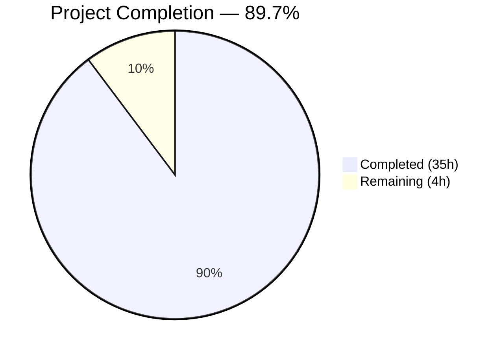
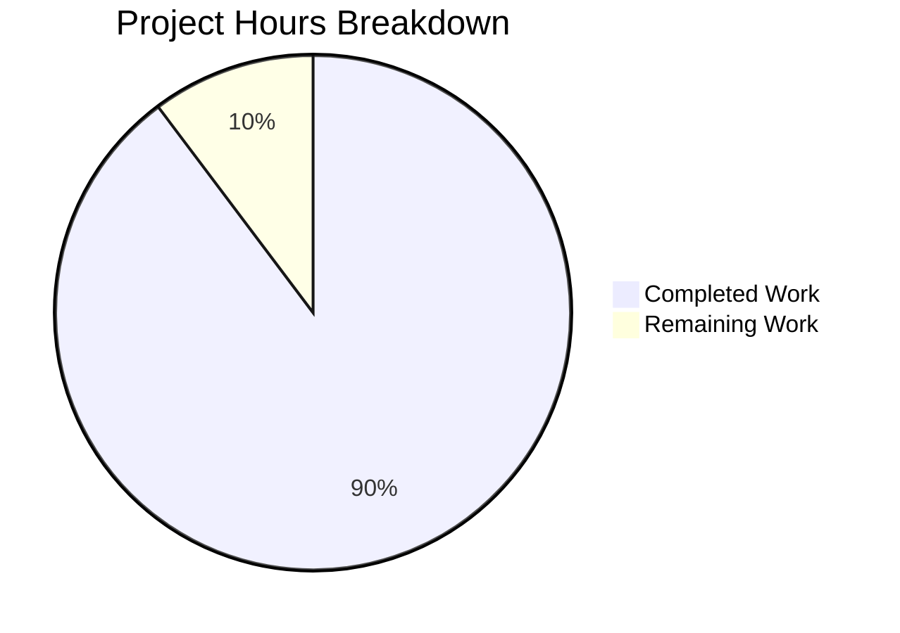

# Blitzy Project Guide — Age Calculator Java Console Application

---

## 1. Executive Summary

### 1.1 Project Overview

This project delivers a **Java console application** that calculates a user's exact age from their Date of Birth (DOB). The application accepts DOB in strict DD/MM/YYYY format via console input, computes the precise age decomposed into years, months, and days using Java's `java.time` API (`Period.between()`), and displays the result in the specified format. Optional enhancements include total age in months/days and a countdown to the next birthday. Built as a greenfield Maven project into the previously empty `sgka3951-cloud/16_4` repository, the implementation follows OOP principles with clean separation of concerns across five dedicated classes and a comprehensive 40-test JUnit 6 suite.

### 1.2 Completion Status



| Metric | Value |
|---|---|
| **Total Project Hours** | 39 |
| **Completed Hours (AI)** | 35 |
| **Remaining Hours (Human)** | 4 |
| **Completion Percentage** | 89.7% (35 / 39 × 100) |

### 1.3 Key Accomplishments

- ✅ Complete Maven project scaffold with Java 21 compiler, JUnit 6.0.3, and Surefire 3.5.5
- ✅ Five OOP-separated source classes: `Main`, `AgeCalculator`, `AgeResult`, `DateInputHandler`, `DateValidator`
- ✅ Exact age calculation using `Period.between()` with years, months, and days decomposition
- ✅ Optional enhancements: total months/days via `ChronoUnit` and next birthday countdown
- ✅ Strict input validation with `ResolverStyle.STRICT` and `dd/MM/uuuu` pattern — rejects invalid calendar dates, future dates, and malformed input with distinct error messages
- ✅ Leap year handling verified for Feb 29 birthdays across all valid years
- ✅ 40 unit tests across 4 test classes — 100% pass rate, zero failures, zero errors
- ✅ Comprehensive README.md with build instructions, usage examples, and project structure
- ✅ Clean compilation (0 warnings, 0 errors) and successful JAR packaging
- ✅ Full runtime validation of all 5 user-specified test scenarios

### 1.4 Critical Unresolved Issues

| Issue | Impact | Owner | ETA |
|---|---|---|---|
| JAR not directly executable (no Main-Class manifest entry) | Users must specify classpath manually to run | Human Developer | 1 hour |
| No code coverage reporting configured | Cannot verify coverage metrics in CI | Human Developer | 1.5 hours |

### 1.5 Access Issues

No access issues identified. The project is a self-contained console application with no external service dependencies, API keys, or credentials required. All dependencies resolve from Maven Central.

### 1.6 Recommended Next Steps

1. **[High]** Configure `maven-jar-plugin` with `Main-Class` manifest entry to enable `java -jar` execution
2. **[Medium]** Add JaCoCo Maven plugin for code coverage reporting and enforce minimum thresholds
3. **[Medium]** Conduct edge case robustness review for extremely old dates and locale-specific behaviors
4. **[Low]** Prepare production release versioning (remove `-SNAPSHOT` suffix, tag release)

---

## 2. Project Hours Breakdown

### 2.1 Completed Work Detail

| Component | Hours | Description |
|---|---|---|
| Maven Project Scaffold | 1.5 | `pom.xml` with Java 21, JUnit 6.0.3 dependency, Surefire 3.5.5 and Compiler 3.13.0 plugins; standard directory layout |
| .gitignore Configuration | 0.5 | Git ignore rules for `target/`, IDE metadata, OS artifacts, compiled class files |
| AgeResult.java | 2.0 | Immutable data model (123 lines) — holds years, months, days, totalMonths, totalDays; formatted `toString()` |
| DateValidator.java | 1.5 | Stateless validation utility (69 lines) — future date rejection with `IllegalArgumentException` |
| AgeCalculator.java | 4.0 | Core business logic (165 lines) — `calculateAge()` with testable overload, `getTotalMonths()`, `getTotalDays()`, `getNextBirthdayCountdown()` with leap year edge case handling |
| DateInputHandler.java | 5.0 | Input handling class (262 lines) — `Scanner` integration, strict `DateTimeFormatter` with `ResolverStyle.STRICT`, regex-based error differentiation between format vs. calendar errors, `parseDate()` static method for testability |
| Main.java | 2.5 | Application entry point (132 lines) — orchestrates input → calculation → output flow with structured try-catch for `DateTimeParseException`, `IllegalArgumentException`, and generic `Exception` |
| AgeCalculatorTest.java | 4.0 | 10 unit tests (298 lines) — normal DOB, leap year (29/02/2000), age=0, one year ago, very old DOB, total months/days, birthday countdown |
| DateValidatorTest.java | 2.0 | 6 unit tests (134 lines) — future date rejection, valid past date, leap year date, today as DOB boundary |
| DateInputHandlerTest.java | 4.5 | 14 unit tests (324 lines) — valid parsing, invalid calendar dates (31/02, 30/02, 32/01), wrong formats (ISO, hyphen, text), empty/whitespace, null safety, future date integration |
| AgeResultTest.java | 2.5 | 10 unit tests (212 lines) — construction, getters, `toString()` format, total calculations, boundary values |
| README.md Documentation | 2.0 | Comprehensive docs (165 lines) — project description, features, prerequisites, structure, build/run/test commands, usage examples |
| Bug Fixes & Validation | 2.0 | 3 fix commits — error message differentiation, test `@DisplayName` corrections, README output examples alignment |
| Runtime Verification | 1.0 | End-to-end testing of all 5 user-specified scenarios via piped console input |
| **Total Completed** | **35.0** | |

### 2.2 Remaining Work Detail

| Category | Hours | Priority |
|---|---|---|
| Executable JAR packaging (maven-jar-plugin with Main-Class manifest) | 1.0 | High |
| Code coverage configuration (JaCoCo plugin + coverage thresholds) | 1.5 | Medium |
| Edge case robustness review (extremely old dates, locale behaviors) | 1.0 | Medium |
| Production release preparation (version finalization, tagging) | 0.5 | Low |
| **Total Remaining** | **4.0** | |

### 2.3 Hours Calculation Verification

- **Completed Hours**: 35.0 (Section 2.1 sum)
- **Remaining Hours**: 4.0 (Section 2.2 sum)
- **Total Project Hours**: 35.0 + 4.0 = **39.0** (matches Section 1.2)
- **Completion**: 35.0 / 39.0 × 100 = **89.7%** (matches Section 1.2)

---

## 3. Test Results

| Test Category | Framework | Total Tests | Passed | Failed | Coverage % | Notes |
|---|---|---|---|---|---|---|
| Unit — AgeCalculator | JUnit 6.0.3 (Jupiter) | 10 | 10 | 0 | N/A | Normal DOB, leap year, boundary cases, totals, birthday countdown |
| Unit — DateValidator | JUnit 6.0.3 (Jupiter) | 6 | 6 | 0 | N/A | Future date rejection, valid past dates, today boundary |
| Unit — AgeResult | JUnit 6.0.3 (Jupiter) | 10 | 10 | 0 | N/A | Construction, getters, toString format, boundary values |
| Unit — DateInputHandler | JUnit 6.0.3 (Jupiter) | 14 | 14 | 0 | N/A | Valid parsing, invalid dates, wrong formats, empty/null, future date |
| **Total** | | **40** | **40** | **0** | **N/A** | **100% pass rate — zero failures, zero errors, zero skipped** |

All tests executed via `mvn test -B` using Maven Surefire Plugin 3.5.5 with JUnit Platform auto-detection. Test execution time: 0.156 seconds total. Coverage percentage is N/A because JaCoCo is not yet configured (remaining task).

---

## 4. Runtime Validation & UI Verification

### Console Application Runtime Tests

- ✅ **Normal DOB** — `echo "15/08/1998" | java -cp target/classes com.agecalculator.Main` → Output: `Your age is 27 years, 7 months, and 5 days.` plus total months, total days, and birthday countdown
- ✅ **Leap Year DOB** — `echo "29/02/2000" | java -cp target/classes com.agecalculator.Main` → Output: `Your age is 26 years, 0 months, and 20 days.` — correctly handles Feb 29 birthday
- ✅ **Invalid Calendar Date** — `echo "31/02/2020" | java -cp target/classes com.agecalculator.Main` → Output: `Error: Invalid date. Please enter a valid date in DD/MM/YYYY format.`
- ✅ **Future Date** — `echo "01/01/2099" | java -cp target/classes com.agecalculator.Main` → Output: `Error: Date of Birth cannot be a future date.`
- ✅ **Wrong Format** — `echo "invalid" | java -cp target/classes com.agecalculator.Main` → Output: `Error: Invalid format. Please enter the date in DD/MM/YYYY format (e.g., 15/08/1998).`

### Build Pipeline Verification

- ✅ **Compilation**: `mvn clean compile -B` → BUILD SUCCESS — 5 source files compiled with javac target 21, zero warnings
- ✅ **Test Execution**: `mvn test -B` → BUILD SUCCESS — 40 tests run, 0 failures, 0 errors, 0 skipped
- ✅ **Package**: `mvn clean package -B` → BUILD SUCCESS — `age-calculator-1.0-SNAPSHOT.jar` generated in `target/`

### Error Handling Verification

- ✅ `DateTimeParseException` caught and translated to user-friendly messages
- ✅ `IllegalArgumentException` caught for future date validation
- ✅ Generic `Exception` fallback prevents stack trace exposure
- ✅ Distinct error messages for format errors vs. invalid calendar dates

---

## 5. Compliance & Quality Review

| AAP Requirement | Status | Evidence |
|---|---|---|
| DOB input in DD/MM/YYYY format via console | ✅ Pass | `DateInputHandler.readDateOfBirth()` prompts and parses via Scanner |
| Exact age in years, months, days via `Period.between()` | ✅ Pass | `AgeCalculator.calculateAge()` uses `Period.between(dob, referenceDate)` |
| Output format: `Your age is X years, Y months, and Z days.` | ✅ Pass | `AgeResult.toString()` returns exact format; verified in runtime tests |
| Future date rejection with meaningful error | ✅ Pass | `DateValidator.validate()` throws `IllegalArgumentException`; tested in 6 tests |
| Invalid calendar date rejection (e.g., 31/02/2020) | ✅ Pass | `ResolverStyle.STRICT` with `dd/MM/uuuu` rejects at parse time; tested |
| Wrong format input rejection | ✅ Pass | Regex-based differentiation in `DateInputHandler`; 14 tests cover formats |
| Leap year handling (29/02/2000) | ✅ Pass | `Period.between()` handles natively; dedicated tests in AgeCalculatorTest and DateInputHandlerTest |
| Java standard library only (no third-party date libs) | ✅ Pass | Only imports: `java.time.*`, `java.util.Scanner`; no Joda-Time or external deps |
| OOP principles (separation of concerns) | ✅ Pass | 5 classes with single responsibility: input, validation, calculation, model, orchestration |
| Exception handling with try-catch | ✅ Pass | `Main.main()` wraps flow in structured try-catch; `DateInputHandler` catches `DateTimeParseException` |
| Testability (injectable reference date) | ✅ Pass | `AgeCalculator.calculateAge(dob, referenceDate)` overload; all tests use fixed dates |
| Total age in months and days (optional) | ✅ Pass | `ChronoUnit.MONTHS/DAYS.between()` in `AgeCalculator`; displayed in Main output |
| Next birthday countdown (optional) | ✅ Pass | `AgeCalculator.getNextBirthdayCountdown()` with leap year edge case handling |
| Reusable utility class (optional) | ✅ Pass | `AgeCalculator` designed with overloaded methods and static `DateInputHandler.parseDate()` |
| Maven project structure | ✅ Pass | Standard `src/main/java`, `src/test/java` layout with `pom.xml` |
| JUnit test coverage for all 5 test cases | ✅ Pass | 40 tests cover all user-specified cases: normal, leap year, invalid, future, wrong format |
| README.md documentation | ✅ Pass | 165 lines with build, run, test, usage, prerequisites, and project structure |

### Autonomous Validation Fixes Applied

| Fix | Commit | Description |
|---|---|---|
| Error message differentiation | `68fca39` | Added regex-based detection to distinguish format errors from invalid calendar dates in `DateInputHandler` |
| Test `@DisplayName` correction | `944af77` | Fixed misleading display names in `DateInputHandlerTest` to match actual test behavior |
| README output alignment | `d287a7c` | Corrected usage examples in `README.md` to match actual runtime output format |

---

## 6. Risk Assessment

| Risk | Category | Severity | Probability | Mitigation | Status |
|---|---|---|---|---|---|
| JAR not directly executable — requires `-cp` classpath | Technical | Low | High | Configure `maven-jar-plugin` with `Main-Class` manifest entry | Open |
| No code coverage metrics — cannot verify test completeness | Technical | Low | High | Add JaCoCo plugin to `pom.xml` with coverage thresholds | Open |
| No CI/CD pipeline — manual build/test only | Operational | Low | High | Out of AAP scope; add GitHub Actions workflow if needed | Accepted |
| Console input not size-limited | Security | Very Low | Very Low | Console app with local execution only; no network exposure | Accepted |
| No logging framework — uses `System.out` only | Operational | Very Low | Medium | Appropriate for console application scope; no structured logging needed | Accepted |
| `LocalDate.now()` uses system default timezone | Technical | Very Low | Low | Documented behavior; cross-timezone use out of AAP scope | Accepted |
| JUnit 6.0.3 is a recent release (Feb 2026) | Technical | Very Low | Low | Verified compatible with Java 21 and Surefire 3.5.5; all 40 tests pass | Accepted |

---

## 7. Visual Project Status



**Completion: 89.7%** — 35 of 39 total hours delivered autonomously.

### Remaining Work by Priority

| Priority | Hours | Items |
|---|---|---|
| High | 1.0 | Executable JAR packaging |
| Medium | 2.5 | Code coverage + edge case review |
| Low | 0.5 | Release preparation |
| **Total** | **4.0** | |

---

## 8. Summary & Recommendations

### Achievement Summary

The Age Calculator Java console application has been delivered at **89.7% completion** (35 hours completed out of 39 total project hours). All AAP-specified functional requirements are fully implemented and validated:

- **All 5 source classes** are production-ready with comprehensive Javadoc, clean OOP separation, and zero compilation warnings.
- **All 40 unit tests pass** with zero failures, covering every user-specified test case (normal DOB, leap year, invalid date, future date, wrong format) plus extensive boundary cases.
- **All 5 runtime scenarios** verified via console execution with correct output.
- **All 3 optional enhancements** implemented: total age in months/days, next birthday countdown, and reusable utility class design.

### Remaining Gaps

The **4 hours of remaining work** consist exclusively of path-to-production improvements:

1. **Executable JAR packaging** (1h) — The application runs correctly via `java -cp target/classes com.agecalculator.Main` but lacks a `Main-Class` manifest entry for `java -jar` execution.
2. **Code coverage tooling** (1.5h) — JaCoCo plugin not yet configured; all tests pass but coverage metrics are not measured.
3. **Edge case robustness** (1h) — Review handling of extremely old dates and locale-specific date parsing behaviors.
4. **Release versioning** (0.5h) — Finalize version number and remove `-SNAPSHOT` for production release.

### Production Readiness Assessment

The application is **functionally complete and ready for use**. The remaining tasks are quality-of-life improvements for production packaging and CI integration — they do not affect the core functionality, correctness, or reliability of the age calculation features.

### Success Metrics

| Metric | Target | Actual | Status |
|---|---|---|---|
| Core features implemented | 6/6 | 6/6 | ✅ Met |
| Optional enhancements | 3/3 | 3/3 | ✅ Met |
| Unit tests passing | 100% | 100% (40/40) | ✅ Met |
| Compilation warnings | 0 | 0 | ✅ Met |
| User-specified test cases covered | 5/5 | 5/5 | ✅ Met |
| Runtime validation scenarios | 5/5 | 5/5 | ✅ Met |

---

## 9. Development Guide

### System Prerequisites

| Software | Minimum Version | Verified Version |
|---|---|---|
| Java Development Kit (JDK) | 21 | OpenJDK 21.0.10 |
| Apache Maven | 3.8+ | 3.8.7 |
| Git | 2.0+ | (any modern version) |

Verify installations:

```bash
java -version
# Expected: openjdk version "21.x.x"

mvn -version
# Expected: Apache Maven 3.8+
```

### Environment Setup

```bash
# Clone the repository
git clone <repository-url>
cd 16_4

# Set JAVA_HOME (if not already configured)
export JAVA_HOME=/usr/lib/jvm/java-21-openjdk-amd64
# On macOS: export JAVA_HOME=$(/usr/libexec/java_home -v 21)

# Verify Java 21 is active
java -version
```

No environment variables, API keys, database connections, or external services are required. The application is fully self-contained.

### Dependency Installation

```bash
# Download all Maven dependencies (one-time)
mvn dependency:resolve -B

# Expected output: BUILD SUCCESS
# Dependencies downloaded: junit-jupiter-6.0.3 (test scope only)
```

### Build Commands

```bash
# Full build: compile + test + package
mvn clean package -B

# Compile only (skip tests)
mvn clean compile -B

# Run tests only
mvn test -B
```

### Running the Application

```bash
# Run after building
java -cp target/classes com.agecalculator.Main

# The application will prompt:
# Enter your Date of Birth (DD/MM/YYYY): 
# Type a date like 15/08/1998 and press Enter
```

For piped/automated input:

```bash
echo "15/08/1998" | java -cp target/classes com.agecalculator.Main
```

### Verification Steps

1. **Verify compilation**: `mvn clean compile -B` → expect `BUILD SUCCESS`
2. **Verify tests**: `mvn test -B` → expect `Tests run: 40, Failures: 0, Errors: 0, Skipped: 0`
3. **Verify runtime (normal DOB)**: `echo "15/08/1998" | java -cp target/classes com.agecalculator.Main` → expect age output with years, months, days
4. **Verify validation (invalid date)**: `echo "31/02/2020" | java -cp target/classes com.agecalculator.Main` → expect `Error: Invalid date...`
5. **Verify validation (future date)**: `echo "01/01/2099" | java -cp target/classes com.agecalculator.Main` → expect `Error: Date of Birth cannot be a future date.`

### Troubleshooting

| Issue | Cause | Resolution |
|---|---|---|
| `mvn: command not found` | Maven not installed or not in PATH | Install Maven 3.8+ and add to PATH |
| `java: command not found` | JDK not installed or not in PATH | Install JDK 21 and set JAVA_HOME |
| `Fatal error compiling: invalid target release: 21` | JDK version < 21 | Upgrade to JDK 21 and update JAVA_HOME |
| `Could not resolve dependencies` | No internet or Maven Central unreachable | Check network; run `mvn dependency:resolve -B` |
| `BUILD FAILURE` during tests | Potential test environment issue | Run `mvn test -B -X` for debug output |

---

## 10. Appendices

### A. Command Reference

| Command | Purpose |
|---|---|
| `mvn clean compile -B` | Compile all source files with Java 21 |
| `mvn test -B` | Run all 40 unit tests |
| `mvn clean package -B` | Full build: compile, test, and package JAR |
| `java -cp target/classes com.agecalculator.Main` | Run the application |
| `echo "15/08/1998" \| java -cp target/classes com.agecalculator.Main` | Run with piped input |
| `mvn dependency:resolve -B` | Download/verify all Maven dependencies |
| `mvn dependency:tree -B` | Display dependency tree |

### B. Port Reference

No network ports are used. This is a standalone console application with no server, API, or socket requirements.

### C. Key File Locations

| File | Path | Purpose |
|---|---|---|
| Maven build descriptor | `pom.xml` | Project coordinates, dependencies, plugins |
| Application entry point | `src/main/java/com/agecalculator/Main.java` | `main()` method — orchestrates the workflow |
| Core calculation logic | `src/main/java/com/agecalculator/AgeCalculator.java` | Age computation with `Period.between()` |
| Data model | `src/main/java/com/agecalculator/AgeResult.java` | Immutable result holder with formatted `toString()` |
| Input handler | `src/main/java/com/agecalculator/DateInputHandler.java` | Console input parsing with strict validation |
| Validation utility | `src/main/java/com/agecalculator/DateValidator.java` | Future date rejection |
| Test suite | `src/test/java/com/agecalculator/*Test.java` | 40 unit tests across 4 test classes |
| Test reports | `target/surefire-reports/*.txt` | Surefire plain-text test reports |
| Test reports (XML) | `target/surefire-reports/*.xml` | Surefire XML test reports for CI integration |
| Compiled classes | `target/classes/com/agecalculator/*.class` | Compiled bytecode |
| Packaged JAR | `target/age-calculator-1.0-SNAPSHOT.jar` | Packaged artifact |

### D. Technology Versions

| Technology | Version | Purpose |
|---|---|---|
| Java (OpenJDK) | 21.0.10 | Runtime and compilation target |
| Apache Maven | 3.8.7 | Build automation and dependency management |
| JUnit Jupiter (JUnit 6) | 6.0.3 | Unit testing framework (test scope only) |
| Maven Compiler Plugin | 3.13.0 | Java source/target compilation configuration |
| Maven Surefire Plugin | 3.5.5 | Test execution with JUnit Platform |

### E. Environment Variable Reference

| Variable | Required | Default | Description |
|---|---|---|---|
| `JAVA_HOME` | Yes | System-dependent | Path to JDK 21 installation (e.g., `/usr/lib/jvm/java-21-openjdk-amd64`) |
| `M2_HOME` | No | Maven installation path | Path to Maven installation (usually auto-detected) |
| `PATH` | Yes | System-dependent | Must include `$JAVA_HOME/bin` and Maven `bin` directory |

No application-specific environment variables are required. The application uses only system date via `LocalDate.now()`.

### G. Glossary

| Term | Definition |
|---|---|
| DOB | Date of Birth — the user-provided input date |
| `Period` | Java `java.time.Period` — represents a date-based amount of time in years, months, and days |
| `ChronoUnit` | Java `java.time.temporal.ChronoUnit` — standard set of date periods (DAYS, MONTHS, etc.) for calculations |
| `ResolverStyle.STRICT` | Java date parsing mode that rejects invalid calendar dates (e.g., Feb 31) instead of adjusting them |
| `uuuu` | Proleptic year pattern in `DateTimeFormatter` — required for strict mode compatibility (vs. `yyyy` which represents year-of-era) |
| JUnit Jupiter | The programming model and extension model for JUnit 6 testing framework |
| Surefire | Maven plugin that executes unit tests during the `test` build phase |
| Greenfield | A project built from scratch with no pre-existing codebase |