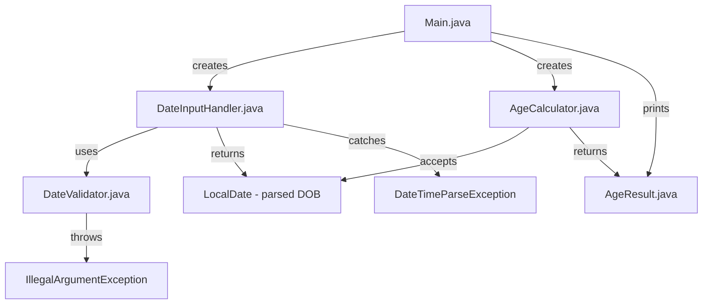

# Technical Specification

# 0. Agent Action Plan

## 0.1 Intent Clarification

### 0.1.1 Core Feature Objective

Based on the prompt, the Blitzy platform understands that the new feature requirement is to develop a **Java console application** that calculates a user's exact age from their Date of Birth (DOB). The application is a standalone, greenfield Java project built into the currently empty `sgka3951-cloud/16_4` repository.

The specific feature requirements are:

- **DOB Input Parsing** — Accept Date of Birth as user input in strict **DD/MM/YYYY** format via the console (`System.in`).
- **Current Date Retrieval** — Automatically fetch the current system date using `java.time.LocalDate.now()`.
- **Precise Age Calculation** — Compute the exact age decomposed into years, months, and days using `java.time.Period.between()`.
- **Formatted Output** — Display results in the exact format: `Your age is X years, Y months, and Z days.`
- **Robust Input Validation** — Reject future dates, invalid calendar dates (e.g., `31/02/2020`), and malformed input strings with meaningful error messages.
- **Leap Year Handling** — Correctly handle leap year birthdays (e.g., `29/02/2000`) across all valid years.

Implicit requirements detected:

- The project requires a complete **Maven project structure** since the repository is currently empty (greenfield).
- A `pom.xml` build descriptor must be created with Java 21 compiler configuration and JUnit test dependencies.
- Object-Oriented Programming principles demand the age calculation logic be encapsulated in a **dedicated utility class** separate from the main entry point.
- Exception handling via `try-catch` implies wrapping all date parsing and validation in structured error handling blocks using `DateTimeParseException` and custom validation logic.

### 0.1.2 Special Instructions and Constraints

The user has specified the following mandatory technical directives:

- **Java Standard Library Only** — Use exclusively `java.time.LocalDate`, `java.time.Period`, and `java.time.format.DateTimeFormatter` from the Java standard library. No third-party date libraries (e.g., Joda-Time) are required.
- **OOP Principles** — The implementation must follow Object-Oriented Programming design: separation of concerns, encapsulation of business logic, and clean class boundaries.
- **Exception Handling** — All input parsing and date validation must use `try-catch` blocks with meaningful, user-friendly error messages.
- **Clean Code Standards** — The codebase must follow readable, well-organized coding conventions.

User-specified optional enhancements include:

- User Example: `Show total age in months and days.`
- User Example: `Display countdown to next birthday.`
- User Example: `Add a simple GUI using Java Swing or JavaFX.`
- User Example: `Convert into a reusable method inside a utility class.`

User-provided sample input and output:

- User Example Input: `Enter your Date of Birth (DD/MM/YYYY): 15/08/1998`
- User Example Output: `Your age is 27 years, 6 months, and 15 days.`

User-specified test cases to cover:

- ✅ Normal DOB (e.g., `15/08/1998`)
- ✅ Leap year DOB (`29/02/2000`)
- ❌ Invalid date (`31/02/2020`)
- ❌ Future date
- ❌ Wrong format input

### 0.1.3 Technical Interpretation

These feature requirements translate to the following technical implementation strategy:

- To **accept and parse DOB input**, we will create a `DateInputHandler` class that uses `java.time.format.DateTimeFormatter.ofPattern("dd/MM/yyyy")` with `ResolverStyle.STRICT` to enforce rigorous date validation, and `Scanner` for console input.
- To **calculate the exact age**, we will create an `AgeCalculator` utility class that invokes `Period.between(birthDate, LocalDate.now())` and exposes the result as years, months, and days.
- To **validate input**, we will implement checks for future dates (`birthDate.isAfter(LocalDate.now())`), invalid calendar dates (caught by `DateTimeParseException` with strict resolver), and malformed format strings.
- To **display formatted output**, we will use `String.format()` or `System.out.printf()` to render the exact output format specified by the user.
- To **handle optional enhancements**, we will create methods for total-months/total-days calculation using `java.time.temporal.ChronoUnit` and next-birthday countdown using `Period.between(today, nextBirthday)`.
- To **ensure OOP compliance**, we will separate the application into a `Main` entry point class, an `AgeCalculator` business-logic class, a `DateInputHandler` input-handling class, and a `DateValidator` validation class.
- To **build and test the project**, we will scaffold a complete Maven project with `pom.xml`, the standard `src/main/java` and `src/test/java` directory layout, and JUnit 6 (Jupiter) test dependencies.

## 0.2 Repository Scope Discovery

### 0.2.1 Comprehensive File Analysis

The repository at `sgka3951-cloud/16_4` is a **greenfield project** containing only a single placeholder file:

| Current File | Contents | Status |
|---|---|---|
| `README.md` | Single heading `# 16_4` — placeholder only | MODIFY — replace with project documentation |

There are **no existing source files, build configurations, dependency manifests, test suites, or application code** in the repository. The entire project structure must be created from scratch.

**Existing modules to modify:**

- `README.md` — Replace placeholder content with full project documentation covering usage instructions, build steps, and feature description.

**Integration point discovery:**

Since this is a greenfield console application with no existing codebase, no pre-existing API endpoints, database models, service classes, controllers, or middleware exist. All integration is internal between the newly created classes.

### 0.2.2 Web Search Research Conducted

Research was conducted across the following areas to inform the implementation strategy:

- **Java age calculation best practices** — Confirmed that `java.time.LocalDate` with `Period.between()` is the standard and recommended approach for age calculation in Java 8+. The `DateTimeFormatter` with `ResolverStyle.STRICT` pattern `"dd/MM/uuuu"` is required for rigorous date validation (using `uuuu` instead of `yyyy` for strict mode compatibility).
- **JUnit testing framework** — Confirmed JUnit 6.0.3 (released February 15, 2026) is the latest GA release under the `org.junit.jupiter` package group, requiring Java 17+. Since we use Java 21, JUnit 6.0.3 is fully compatible. Maven Surefire Plugin 3.0.0+ is required for JUnit 6 support.
- **Maven project structure** — Confirmed the standard Maven directory layout: `src/main/java` for application sources, `src/test/java` for test sources, `src/main/resources` and `src/test/resources` for configuration files, with `pom.xml` at the project root.
- **Input validation patterns** — `DateTimeParseException` is the standard exception thrown when `LocalDate.parse()` encounters invalid input. Combined with `ResolverStyle.STRICT`, this catches invalid calendar dates like February 31.

### 0.2.3 New File Requirements

**New source files to create:**

| File Path | Purpose |
|---|---|
| `pom.xml` | Maven Project Object Model — defines Java 21 compiler settings, JUnit 6.0.3 test dependency, and maven-surefire-plugin configuration |
| `src/main/java/com/agecalculator/Main.java` | Application entry point — contains `main()` method, orchestrates user interaction via console |
| `src/main/java/com/agecalculator/AgeCalculator.java` | Core business logic — encapsulates age calculation using `Period.between()`, provides methods for years/months/days breakdown, total months/days, and next birthday countdown |
| `src/main/java/com/agecalculator/DateInputHandler.java` | Input handling — reads DOB from console using `Scanner`, parses with `DateTimeFormatter`, delegates to `DateValidator` |
| `src/main/java/com/agecalculator/DateValidator.java` | Validation logic — validates parsed date is not in the future, provides meaningful error messages for each validation failure |
| `src/main/java/com/agecalculator/AgeResult.java` | Data model — immutable record/class holding computed age result (years, months, days, total months, total days) |

**New test files to create:**

| File Path | Purpose |
|---|---|
| `src/test/java/com/agecalculator/AgeCalculatorTest.java` | Unit tests for age calculation logic — normal DOB, leap year DOB, boundary cases |
| `src/test/java/com/agecalculator/DateValidatorTest.java` | Unit tests for date validation — future date rejection, invalid date detection |
| `src/test/java/com/agecalculator/DateInputHandlerTest.java` | Unit tests for input parsing — valid format, wrong format, edge cases |
| `src/test/java/com/agecalculator/AgeResultTest.java` | Unit tests for the data model — result construction, total calculations |

**New configuration and documentation:**

| File Path | Purpose |
|---|---|
| `README.md` | Updated project documentation — build instructions, usage guide, feature list (overwrite existing placeholder) |
| `.gitignore` | Git ignore rules — exclude `target/`, IDE files (`.idea/`, `*.iml`), OS files (`.DS_Store`) |

## 0.3 Dependency Inventory

### 0.3.1 Private and Public Packages

This project uses **exclusively Java standard library APIs** for its core functionality, with a single external dependency for testing. No private packages are required.

| Registry | Package | Artifact | Version | Scope | Purpose |
|---|---|---|---|---|---|
| Maven Central | `org.junit.jupiter` | `junit-jupiter` | `6.0.3` | test | JUnit Jupiter aggregator — provides test API (`junit-jupiter-api`) and engine (`junit-jupiter-engine`) for writing and executing unit tests |
| Maven Central | `org.apache.maven.plugins` | `maven-surefire-plugin` | `3.5.5` | build plugin | Maven Surefire Plugin — executes JUnit tests during the `mvn test` phase; version 3.0.0+ required for native JUnit 6 support |
| Maven Central | `org.apache.maven.plugins` | `maven-compiler-plugin` | `3.13.0` | build plugin | Maven Compiler Plugin — configures Java 21 source and target compilation levels |

**Java Standard Library Dependencies (no external download required):**

| Package | Class | Purpose |
|---|---|---|
| `java.time` | `LocalDate` | Represents date without time zone — used for both DOB and current date |
| `java.time` | `Period` | Represents date-based duration in years/months/days — core of age calculation |
| `java.time.format` | `DateTimeFormatter` | Parses DOB string input in DD/MM/YYYY format |
| `java.time.format` | `ResolverStyle` | Enforces STRICT date resolution to reject invalid calendar dates |
| `java.time.temporal` | `ChronoUnit` | Computes total age in single units (total months, total days) for optional enhancements |
| `java.util` | `Scanner` | Reads user input from console (`System.in`) |

### 0.3.2 Dependency Updates

Since this is a greenfield project with no existing dependency manifest, there are no import updates or external reference updates required. All dependencies are net-new additions defined in the `pom.xml` to be created.

**Import patterns for source files:**

- `src/main/java/com/agecalculator/*.java` — Standard library imports only:
  - `import java.time.LocalDate;`
  - `import java.time.Period;`
  - `import java.time.format.DateTimeFormatter;`
  - `import java.time.format.ResolverStyle;`
  - `import java.time.format.DateTimeParseException;`
  - `import java.time.temporal.ChronoUnit;`
  - `import java.util.Scanner;`

- `src/test/java/com/agecalculator/*.java` — JUnit 6 Jupiter imports:
  - `import org.junit.jupiter.api.Test;`
  - `import org.junit.jupiter.api.DisplayName;`
  - `import org.junit.jupiter.api.BeforeEach;`
  - `import static org.junit.jupiter.api.Assertions.*;`

**Build configuration (pom.xml) key elements:**

- `maven.compiler.source` → `21`
- `maven.compiler.target` → `21`
- `project.build.sourceEncoding` → `UTF-8`
- JUnit Jupiter dependency with `<scope>test</scope>`
- Maven Surefire Plugin version `3.5.5` for JUnit 6 native support

## 0.4 Integration Analysis

### 0.4.1 Existing Code Touchpoints

Since the repository is greenfield with only a placeholder `README.md`, there are **no existing code touchpoints** to modify. All integration is between the newly created classes within the same project.

**Direct modifications required:**

- `README.md` — Overwrite the placeholder content (`# 16_4`) with comprehensive project documentation including project description, prerequisites, build instructions, usage guide, and test execution steps.

### 0.4.2 Internal Class Integration Map

The following diagram illustrates the integration relationships between the new classes:

**Integration flow description:**

- `Main.java` serves as the orchestrator — it instantiates `DateInputHandler` to acquire the parsed `LocalDate` from user input, passes it to `AgeCalculator.calculateAge()`, receives an `AgeResult`, and formats the output to the console.
- `DateInputHandler.java` depends on `DateValidator.java` for post-parse validation (future date check) and on `java.time.format.DateTimeFormatter` for parsing the DD/MM/YYYY string.
- `AgeCalculator.java` depends on `java.time.Period` and `java.time.temporal.ChronoUnit` for all computation. It accepts a `LocalDate` (DOB) and optionally a reference date (defaulting to `LocalDate.now()`), and returns an `AgeResult`.
- `AgeResult.java` is a standalone data-holder class with no external dependencies.
- `DateValidator.java` is a standalone validation class that checks date constraints and produces descriptive error messages.

### 0.4.3 Database/Schema Updates

This is a pure console application with no database, persistence layer, or schema requirements. No migrations, schema files, or data-access objects are needed.

### 0.4.4 External System Integration

This application has no external system integrations. It operates entirely as a self-contained command-line tool using:

- **Input**: `System.in` (console standard input)
- **Output**: `System.out` (console standard output)
- **Date Source**: `java.time.LocalDate.now()` (system clock)

No network calls, file I/O, API integrations, or third-party service connections are required.

## 0.5 Technical Implementation

### 0.5.1 File-by-File Execution Plan

Every file listed below MUST be created or modified. The repository is greenfield, so all application files are new creations except `README.md` which is modified.

**Group 1 — Project Scaffolding:**

- **CREATE: `pom.xml`** — Maven Project Object Model at the repository root. Defines `groupId` as `com.agecalculator`, `artifactId` as `age-calculator`, compiler source/target as `21`, UTF-8 encoding, JUnit Jupiter `6.0.3` test dependency, and Maven Surefire Plugin `3.5.5` for test execution.
- **CREATE: `.gitignore`** — Git ignore rules excluding `target/`, IDE metadata (`.idea/`, `*.iml`, `.classpath`, `.project`, `.settings/`), OS artifacts (`.DS_Store`, `Thumbs.db`), and compiled class files (`*.class`).

**Group 2 — Core Feature Source Files:**

- **CREATE: `src/main/java/com/agecalculator/Main.java`** — Application entry point. Contains the `public static void main(String[] args)` method. Instantiates `DateInputHandler` to prompt and parse DOB, passes the parsed `LocalDate` to `AgeCalculator`, receives an `AgeResult`, and prints the formatted output. Wraps the entire flow in a `try-catch` to handle unexpected errors gracefully.
- **CREATE: `src/main/java/com/agecalculator/AgeCalculator.java`** — Core business logic class. Provides:
  - `calculateAge(LocalDate dob)` — calculates age using `Period.between(dob, LocalDate.now())`, returns `AgeResult`.
  - `calculateAge(LocalDate dob, LocalDate referenceDate)` — overloaded method accepting a custom reference date for testability.
  - `getTotalMonths(LocalDate dob, LocalDate referenceDate)` — returns total age in months via `ChronoUnit.MONTHS.between()`.
  - `getTotalDays(LocalDate dob, LocalDate referenceDate)` — returns total age in days via `ChronoUnit.DAYS.between()`.
  - `getNextBirthdayCountdown(LocalDate dob, LocalDate referenceDate)` — calculates days remaining until next birthday.
- **CREATE: `src/main/java/com/agecalculator/DateInputHandler.java`** — Input handling class. Uses `Scanner` to read from `System.in`, applies `DateTimeFormatter.ofPattern("dd/MM/uuuu").withResolverStyle(ResolverStyle.STRICT)` for parsing, catches `DateTimeParseException` for malformed input, and delegates to `DateValidator` for semantic validation.
- **CREATE: `src/main/java/com/agecalculator/DateValidator.java`** — Validation utility class. Provides `validate(LocalDate dob)` which throws `IllegalArgumentException` with descriptive messages if the DOB is in the future. Designed as a stateless utility with static methods.
- **CREATE: `src/main/java/com/agecalculator/AgeResult.java`** — Immutable data model class. Stores calculated age as `years`, `months`, `days`, `totalMonths`, and `totalDays`. Provides getter methods and a `toString()` method that returns the formatted string `Your age is X years, Y months, and Z days.`

**Group 3 — Test Suite:**

- **CREATE: `src/test/java/com/agecalculator/AgeCalculatorTest.java`** — Comprehensive unit tests for `AgeCalculator`:
  - Normal DOB (e.g., `15/08/1998`)
  - Leap year DOB (`29/02/2000`)
  - DOB on current date (age = 0)
  - DOB exactly one year ago
  - Very old DOB (e.g., `01/01/1900`)
  - Total months and total days calculations
  - Next birthday countdown
- **CREATE: `src/test/java/com/agecalculator/DateValidatorTest.java`** — Unit tests for validation:
  - Future date rejection with appropriate error message
  - Valid past date acceptance
  - Today's date as DOB (edge case — age is 0)
- **CREATE: `src/test/java/com/agecalculator/DateInputHandlerTest.java`** — Unit tests for input parsing:
  - Valid `DD/MM/YYYY` format parsing
  - Invalid date `31/02/2020` rejection
  - Wrong format input (e.g., `1998-08-15`, `15-08-1998`)
  - Empty string input handling
  - Null-safety checks
- **CREATE: `src/test/java/com/agecalculator/AgeResultTest.java`** — Unit tests for the data model:
  - Construction with valid values
  - `toString()` format verification
  - Getter method correctness

**Group 4 — Documentation:**

- **MODIFY: `README.md`** — Replace placeholder `# 16_4` with comprehensive documentation:
  - Project title and description
  - Prerequisites (Java 21, Maven 3.8+)
  - Build instructions (`mvn clean package`)
  - Run instructions (`java -cp target/classes com.agecalculator.Main`)
  - Test execution (`mvn test`)
  - Feature list and usage examples
  - Project structure overview

### 0.5.2 Implementation Approach per File

The implementation follows a layered approach:

- **Establish project foundation** by creating `pom.xml` with all required build configurations and dependencies, followed by the standard Maven directory structure.
- **Build the core calculation engine** by implementing `AgeCalculator.java` and `AgeResult.java` as the innermost layer with zero external dependencies beyond the Java standard library.
- **Add input and validation layers** by implementing `DateInputHandler.java` and `DateValidator.java` that interface between raw user input and the calculation engine.
- **Create the orchestration layer** by implementing `Main.java` that ties all components together and manages the console interaction lifecycle.
- **Ensure quality through comprehensive testing** by implementing all four test classes covering the user-specified test cases plus additional edge cases.
- **Finalize documentation** by updating `README.md` with complete project information.

### 0.5.3 Key Implementation Details

**Date format handling:** The user specifies `DD/MM/YYYY` input format. For strict validation with `ResolverStyle.STRICT`, the pattern must use `"dd/MM/uuuu"` instead of `"dd/MM/yyyy"` because `yyyy` represents "year-of-era" which does not work correctly with strict resolver mode, while `uuuu` represents "year" and is compatible.

**Testability design:** The `AgeCalculator.calculateAge()` method accepts an optional `LocalDate referenceDate` parameter instead of always calling `LocalDate.now()` internally. This allows unit tests to inject deterministic dates rather than depending on the system clock, ensuring reproducible test results.

**Error message strategy:** Each validation failure produces a distinct, user-friendly message:
- Future date: `"Date of Birth cannot be a future date."`
- Invalid calendar date: `"Invalid date. Please enter a valid date in DD/MM/YYYY format."`
- Wrong format: `"Invalid format. Please enter the date in DD/MM/YYYY format (e.g., 15/08/1998)."`

## 0.6 Scope Boundaries

### 0.6.1 Exhaustively In Scope

**All project source files:**

- `src/main/java/com/agecalculator/**/*.java` — All application source classes (`Main.java`, `AgeCalculator.java`, `DateInputHandler.java`, `DateValidator.java`, `AgeResult.java`)

**All project test files:**

- `src/test/java/com/agecalculator/**/*Test.java` — All unit test classes (`AgeCalculatorTest.java`, `DateValidatorTest.java`, `DateInputHandlerTest.java`, `AgeResultTest.java`)

**Build and configuration files:**

- `pom.xml` — Maven build descriptor with Java 21 compiler settings, JUnit 6.0.3 dependency, Surefire plugin 3.5.5
- `.gitignore` — Git ignore rules for build artifacts and IDE metadata

**Documentation files:**

- `README.md` — Comprehensive project documentation (overwrite existing placeholder)

**Functional scope — core features:**

- DOB input in `DD/MM/YYYY` format via console
- Exact age calculation in years, months, and days
- Formatted output: `Your age is X years, Y months, and Z days.`
- Input validation: future date rejection, invalid date detection, wrong format handling
- Leap year correctness for all valid years
- Exception handling with `try-catch` and meaningful error messages

**Functional scope — optional enhancements:**

- Total age display in months and days (via `ChronoUnit`)
- Countdown to next birthday (via `Period.between()` with projected next birthday date)
- Reusable utility class design (via `AgeCalculator` with overloaded methods)

### 0.6.2 Explicitly Out of Scope

- **GUI implementation (Java Swing / JavaFX)** — Listed as an optional enhancement by the user but not included in the core implementation scope. The console application fulfills all functional requirements. GUI can be added as a future enhancement.
- **Web interface or REST API** — No web layer, HTTP endpoints, or server-side components.
- **Database or persistence** — No data storage, user profiles, or history tracking.
- **Multi-language / internationalization** — English-only console messages and date format.
- **Time zone handling** — The application uses the system default time zone via `LocalDate.now()`. Cross-timezone calculations are out of scope.
- **Deployment automation** — No Docker, CI/CD pipelines, or cloud deployment configurations. The application is run locally via Maven or direct Java execution.
- **Python/TypeScript/Flask/React/MongoDB architecture** — The auto-generated tech spec prescribes a Python 3.13.x + TypeScript 5.9.x + Flask + React + MongoDB stack. This entire stack is **out of scope** and superseded by the user's explicit Java requirements.
- **Performance optimization** — The application processes a single date calculation per execution; no performance tuning is necessary.
- **Security hardening** — No network exposure, authentication, or authorization required for a local console application.

## 0.7 Rules for Feature Addition

### 0.7.1 User-Specified Rules and Requirements

The user has explicitly emphasized the following rules and conventions:

- **Use `java.time.LocalDate`, `java.time.Period`, and `java.time.format.DateTimeFormatter`** — These three classes are mandatory for the implementation. No alternative date/time libraries or legacy `java.util.Date`/`Calendar` APIs are permitted.
- **Follow Object-Oriented Programming principles** — The application must demonstrate clean OOP design: single responsibility per class, encapsulation of internal state, clear public interfaces, and separation of input handling from business logic.
- **Proper exception handling using `try-catch`** — All potentially failing operations (date parsing, validation) must be wrapped in structured exception handling. Exceptions must not propagate unhandled to the user.
- **Clean and readable coding standards** — Code must be well-organized, properly indented, use meaningful variable and method names, and include appropriate Javadoc comments on public classes and methods.
- **Handle leap years correctly** — The age calculation must produce accurate results for leap year birthdays (e.g., `29/02/2000`). The `java.time.Period.between()` method handles this natively, but test coverage must explicitly verify it.
- **Work for users born in any valid year** — The application must accept any historically valid date, including very old dates (e.g., `01/01/1900`) and dates near the current date.

### 0.7.2 Convention and Pattern Rules

- **Maven standard directory layout** — All source files under `src/main/java/`, all test files under `src/test/java/`, configuration resources under `src/main/resources/` if needed.
- **Package naming** — Use `com.agecalculator` as the base package, following Java naming conventions.
- **Test naming** — Test classes must be named `*Test.java` (e.g., `AgeCalculatorTest.java`) to be automatically discovered by the Maven Surefire Plugin.
- **Strict date parsing** — Use `ResolverStyle.STRICT` with pattern `"dd/MM/uuuu"` to ensure invalid calendar dates (like February 31) are rejected at parse time, not silently adjusted.
- **Testability** — Business logic classes must accept injected parameters (e.g., reference date) rather than calling `LocalDate.now()` directly, enabling deterministic unit testing.
- **No hardcoded dates** — The current date must always be retrieved dynamically via `LocalDate.now()` at runtime; test classes use injected fixed dates.

## 0.8 References

### 0.8.1 Repository Files Searched

The following files and directories were explored during the codebase analysis:

| Path | Type | Outcome |
|---|---|---|
| `/` (repository root) | Folder | Explored — contains only `README.md`; no source directories, build files, or configuration present |
| `README.md` | File | Read — contains only placeholder heading `# 16_4`; confirms greenfield state |

A comprehensive search for `.blitzyignore` files across the entire filesystem returned no results, confirming no ignore patterns apply.

### 0.8.2 Tech Spec Sections Consulted

The following technical specification sections were retrieved and analyzed to understand the project context and identify conflicts with the user's Java requirements:

| Section | Key Findings |
|---|---|
| **1.1 Executive Summary** | Project `16_4` hosted at `sgka3951-cloud/16_4` on GitHub, initialized Oct 16 2025, GENERATE mode, stakeholder `sgka3951-cloud` (sgka3951@gmail.com), greenfield repository with placeholder README only |
| **2.1 Feature Catalog** | Four features defined; F-004 (Core Application Logic) is the relevant feature — status "Proposed" with no implementation details; all technology decisions formally open |
| **3.1 Programming Languages** | Auto-generated spec prescribes Python 3.13.x and TypeScript 5.9.x — **conflicts with user's Java requirement**; this prescription is overridden by the user's explicit instructions |
| **5.1 High-Level Architecture** | Describes a three-tier web application (React SPA + Flask REST API + MongoDB) — **not applicable** to the user's Java console application; this architecture is superseded |
| **6.6 Testing Strategy** | Prescribes pytest, Jest, coverage.py, Istanbul, Flake8, ESLint — **all Python/TypeScript tooling**, not applicable; replaced by JUnit 6 + Maven Surefire for Java testing |

### 0.8.3 Web Research Conducted

| Research Topic | Key Sources | Findings Applied |
|---|---|---|
| Java age calculation with `LocalDate` and `Period` | Baeldung (baeldung.com/java-get-age), GeeksForGeeks, Oracle Java Tutorials | Confirmed `Period.between()` as standard approach; `ResolverStyle.STRICT` with `"uuuu"` pattern for rigorous validation |
| JUnit 6 / Jupiter latest version and Maven setup | junit.org User Guide, Maven Central, GitHub junit-team/junit-framework | JUnit 6.0.3 (GA, Feb 15 2026) under `org.junit.jupiter` group; requires Java 17+; Maven Surefire 3.0.0+ for native support |
| Maven project structure for Java console applications | maven.apache.org Standard Directory Layout, Maven Getting Started Guide | Standard layout: `src/main/java`, `src/test/java`, `pom.xml` at root; archetype `maven-archetype-quickstart` as reference |

### 0.8.4 User Attachments and External Metadata

- **Attachments provided**: None (0 attachments)
- **Environment files**: None found in `/tmp/environments_files/`
- **Figma URLs**: None provided
- **Setup instructions**: None provided by user
- **Environment variables**: None specified
- **Secrets**: None specified
- **Implementation rules**: None specified beyond the feature prompt

